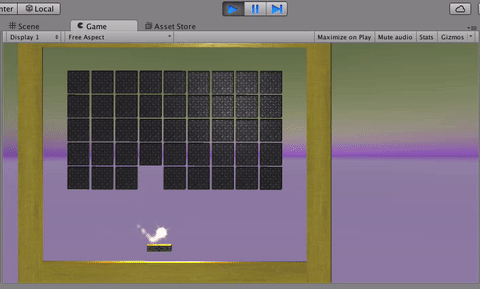

We're going to make a clone of the popular 80s game, “Breakout”. If you're unfamiliar with it, it looks like [this](https://www.youtube.com/watch?v=Up-a5x3coC0).

Our game will look like this!

We're going to make it with Unity, without even writing any code.  We'll only have to change a little code in some places.

If you want to write code you can do the challenges at the end of the tutorial.

This exercise is purely to learn about how to build a Scene with Unity, learn about some unity constructs, and learn how to build dynamic Scenes, meaning Scenes that generate elements based on code.
