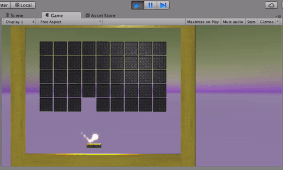

We're going to make a clone of the popular _80's_ game, _Breakout_. If you're unfamiliar with it, it looks like this:

Our game will look like this!

We're going to make it with Unity and this time focus on building interfaces. Instead of giving you an implemented GUI, we'll give you implemented code so you can build the interface and hook it up!

If you want to write code you can do the challenges at the end of the tutorial.

This exercise is purely to learn about how to build a Scene with Unity, learn about some unity constructs, and learn how to build _dynamic Scenes_, meaning Scenes that generate elements based on code.
