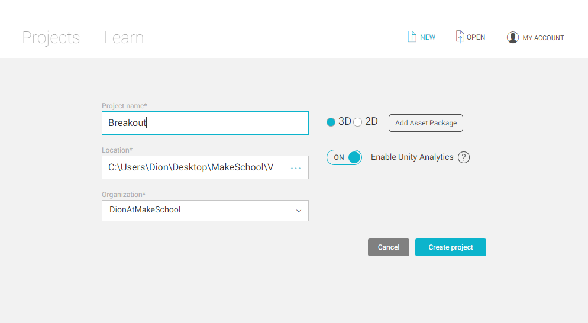
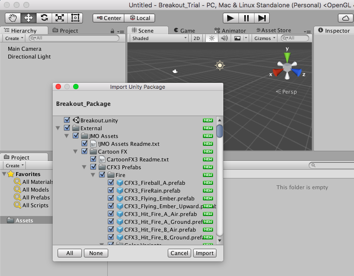
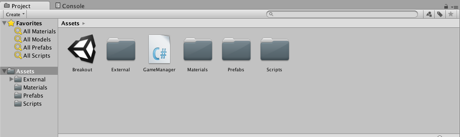
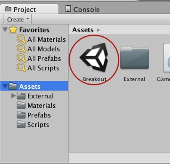
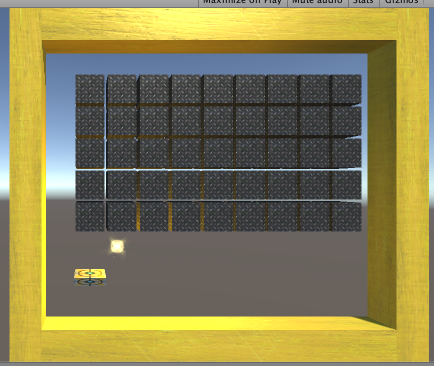
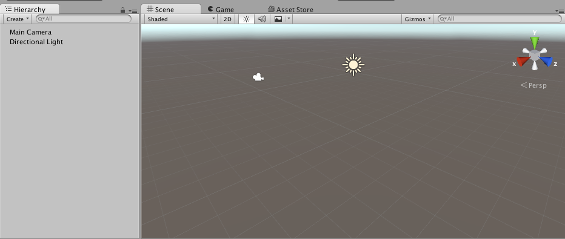
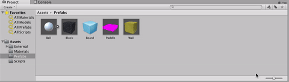
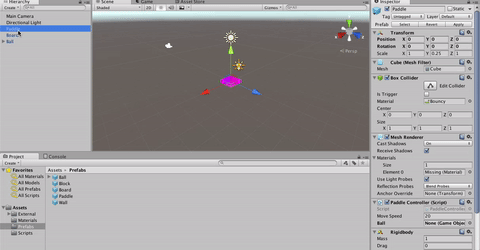
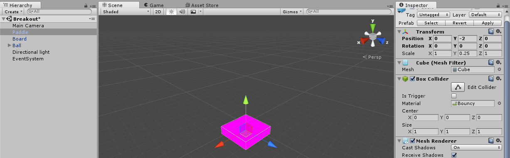
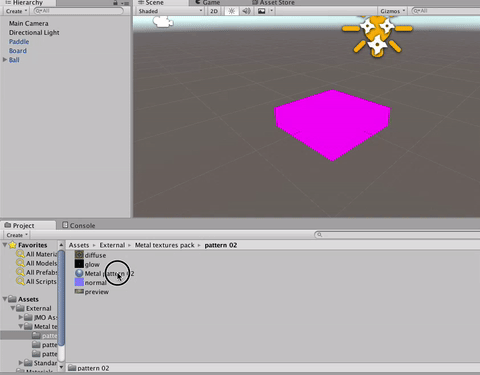

> [action]
>To get started please make an empty 3D project and call it Breakout.



> [action]
>First things first, import the Breakout Package, which you can get via:
>
```
git clone https://MakeSchool-Tutorials@bitbucket.org/MakeSchool-Tutorials/breakout-unity.git
```



This will populate your Assets folder in the Project Panel with a structure of objects that we'll use to build the game.



We've also provided a Scene that shows the final layout of the objects, named Breakout.



Feel free to double-click to open it and check it out if you'd like.



If you have, create a new Scene, so that you can set everything up from the basic pieces (File->New Scene).



> [action]
>Now open up the Prefabs folder and drag the Ball, Board, and Paddle into the Hierarchy Panel.

In order to make our files a little easier to see, by the way, we've reduced the size of our icons.




> [info]
>Dragging objects from the Project Panel into the Hierarchy Panel or the Scene View adds those objects to the Scene. Dragging into the Hierarchy Panel allows you to drag multiple and sets their positions to the defaults for you, whereas dragging into the Scene View only allows you to drag one, but allows you to position it visually when you drop it in.

<!-- -->

> [action]
>Now select the Paddle in the Hierarchy Panel and drag the Ball in the Hierarchy Panel into the Ball slot (under Paddle Controller in the Inspector on the right).



This assigns one of the components, which is a script, on the Paddle to reference the Ball in our Scene.

We now want to position our Board and Paddle.

> [action]
>Click to select the Board in the Hierarchy and then set its position in the Inspector to (0,0,0). Then set the Paddle to position (0,-2,0).



You may have noticed that the Paddle is pink, this is because it has no Material. Materials give objects color, and pink is the color Unity assigns if no color is defined.

> [action]
>Open on the "External/Metal textures pack/pattern 02" folder in your Project and drag "Pattern 02" to the Paddle to apply the Material to the Paddle.



If you're interested in a more technical definition of what a material does, it tells the 3D renderer how to draw an object. Specifically, it tells the renderer what kind of shader to use, and what properties to send to that shader.

A shader is a piece of code the describes the rules on how to draw an object. Some shaders allow an object to be transparent like glass, others have rules to texture an object, or make it metallic. Shaders can do fancy things like tell the renderer how to bend light, or just to color a mesh with an image.
solid color.

In this case we are just going to draw a texture (image) on an object.
