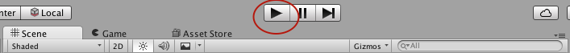
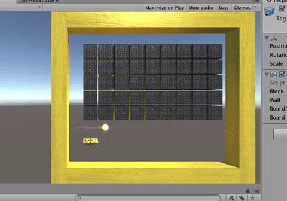

Now if you push Play button up top you can play the finished game in the Scene you just made!





Press space to launch the ball, and use the arrow keys to move the paddle.

You may notice the paddle is too fast, moves backwards, and goes through the walls! We'll show you how to slow down the paddle and make it move the correct direction. We'll leave the wall problem as an exercise for you at the end of this tutorial ;)

> [action]
>Slow down the Paddle by selecting it and changing the Move Speed value in it's Paddle Controller component to 10.


Now when you run the Scene, the Paddle should move more slowly, though it still moves backwards.


In order to fix the Paddle's movement, we'll want to look at the Paddle Controller component.

> [action]
>Open the folder Scripts and double-click PaddleController to open it up in Visual Studio.


Your job is to make the paddle move the correct direction (left when you press the Left Arrow Key and right when you press the Right Arrow Key).

The code that controls the Paddle's movement is in the Update() function and looks like this:

```
if(Input.GetKey(KeyCode.LeftArrow))
{
  this.transform.position = new Vector3((this.transform.position.x + (moveSpeed * Time.deltaTime)), this.transform.position.y, this.transform.position.z);
}

if(Input.GetKey(KeyCode.RightArrow))
{
  this.transform.position = new Vector3(this.transform.position.x - (moveSpeed * Time.deltaTime), this.transform.position.y, this.transform.position.z);
}
```

Specifically, Input.GetKey(KeyCode.LeftArrow) checks whether or not the Left Arrow Key is held down and Input.GetKey(KeyCode.RightArrow) checks whether or not the Right Arrow Key is held down.

> [action]
>Change the code so that the Left Arrow Key moves the paddle left and the Right Arrow Key moves the paddle right. Be sure to run the Scene to make sure your solution worked!

<!-- -->

> [solution]
>
>We fixed this by switching RightArrow with LeftArrow:
>
>```
>if(Input.GetKey(KeyCode.RightArrow))
>{
>  this.transform.position = new Vector3((this.transform.position.x + (moveSpeed * Time.deltaTime)), this.transform.position.y, this.transform.position.z);
>}
>
>if(Input.GetKey(KeyCode.LeftArrow))
>{
>  this.transform.position = new Vector3(this.transform.position.x - (moveSpeed * Time.deltaTime), this.transform.position.y, this.transform.position.z);
>}
>```
