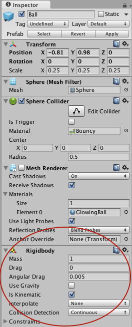
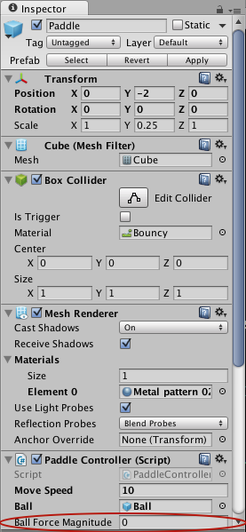
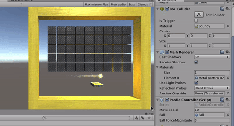

Now let's look more specifically at how this game works.

Our ball moves through space using physics, objects that bump into it will affect it, and it can affect other physics objects by bumping into them. Unity uses something called a physics engine to figure out how objects that have physics should move, and you can tell an object to use the physics engine by giving it a **Rigidbody** component.



Objects that do not move but are still part of the physics simulation (like a wall or a floor) are marked as `Is Kinematic`. `Is Kinematic` is used for the paddle, and boundary walls. The paddle does move, but physics does not move it, we move it manually by setting its position in space rather than relying on the physics engine.

`But wait!` you ask… Why is the ball _Kinematic_ too? Doesn’t it need physics? Good observation, it does, but before we launch the ball it starts as _Kinematic_, when we press the `spacebar` it removes the `isKinematic` flag.

The code is in the `Update` method of `PaddleController`:

```
if(Input.GetKey(KeyCode.Space))
{
  if(ballBody.isKinematic)
  {
    ballBody.isKinematic = false;
    ball.transform.LookAt(this.gameObject.transform);
    ballBody.AddForce(ball.transform.forward.normalized * 5f, ForceMode.VelocityChange);
  }
}
```

Notice how we set `isKinematic` to false, then tell the ball to look at the paddle then add the force of the ball going forward `* 5f`. When you multiply a vector by a single number it lengthens the magnitude of the vector or scales it to be longer. When we are applying force, a higher magnitude means it will go further with more force. In this case, we are taking forward which is just a direction, then scaling it by a magnitude of 5.

tl;dr we do some math to make the ball go to the paddle with a force of power `5`.

But that `5` was hard-coded. When you're coding a big project, it's generally not great practice to hard-code values that have been arbitrarily chosen, like this 5. It'd be much better if it were a variable.

# Goodbye magic number

In Unity, you can do even better by making it a public variable.

> [action]
>
Add the following under "public GameObject ball;":
>
```
public float ballForceMagnitude;
```
>
and change the line:
>
```
ballBody.AddForce(ball.transform.forward.normalized * ballForceMagnitude, ForceMode.VelocityChange);
```

Now when you select Paddle in the Editor and look at the Inspector, you should see a Ball Force Power field in the Editor.



> [action]
>
Experiment with different ball launch strengths to see how it affects gameplay. You can even do this while the game is playing! It'll go back to the original value when you stop the game.
>

