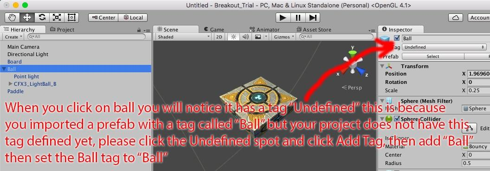

Now let’s look at the GameBoardGenerator.cs script. This script is
attached to the Game Board.

This script will dynamically generate a game board of any size you
wish. It is useful to know how to build dynamic objects using Unity, so
we can go through the code line by line to understand it.
```
void Start () {

		//This code block creates ceiling, floor, left wall and right wall using Instantiate();
		//Instantiate let you create any kind of object in Unity, so it is important that you say as GameObject
		//to type cast the created object to GameObject.  As you know C# is statically typed, and everything must be
		//strongly cast to a specific type.  The word cast means change the type.  You can change specific types into
		//More generic types when necessary or vice versa.  In this case Instantiate creates an Object, but we know
		//the object will be a GameObject, and we are making a GameObject variable.  You can’t set an Object to a
		//GameObject without telling the compiler you want to do this using a cast, so we use as GameObject to cast.
		//There is another way to cast also by writing it like this: GameObject ceiling = (GameObject)Instantiate(wall);
		GameObject ceiling = Instantiate(wall) as GameObject;
		GameObject floor = Instantiate(wall) as GameObject;
		GameObject leftWall = Instantiate(wall) as GameObject;
		GameObject rightWall = Instantiate(wall) as GameObject;

		//Make the 4 walls children of the game board object — this is how you dynamically child/parent objects
		rightWall.transform.parent = this.transform;
		leftWall.transform.parent = this.transform;
		ceiling.transform.parent = this.transform;
		floor.transform.parent = this.transform;

		//set floor position
		floor.transform.localPosition = new Vector3(boardWidth / 2f, -4f, 0f);
		floor.transform.localScale = new Vector3(boardWidth + 3f, 1f, 1f);
		floor.AddComponent<DeathZone>();

		//set ceiling position
		ceiling.transform.localPosition = new Vector3(boardWidth / 2f, (boardHeight + 2f), 0f);
		ceiling.transform.localScale = new Vector3(boardWidth + 3f, 1f, 1f);

		//set right wall position
		rightWall.transform.localPosition = new Vector3(-2f, (boardHeight / 2f) - 1f, 0f);
		rightWall.transform.localScale = new Vector3(1f, boardHeight + 7f, 1f);

		//set left wall position
		leftWall.transform.localPosition = new Vector3(boardWidth + 2f, (boardHeight / 2f) - 1f, 0f);
		leftWall.transform.localScale = new Vector3(1f, boardHeight + 7f, 1f);
		//now we make two loops, one for rows and one for columns.  We are using a scale of 1 so it makes
		//everything very easy, we just create each block and set it’s localPosition to the value of i,j;
		//If you use localPosition it will be the position relative to the objects parent, if you use position it will be
		//position in world space.
		for(int i = 0; i <= boardWidth; i++)
		{
			for(int j = 0; j <= boardHeight; j++)
			{
				//create blocks
				GameObject newBlock = Instantiate(block) as GameObject;
				newBlock.transform.parent = this.transform;
				newBlock.transform.localPosition = new Vector3((float)i, (float)j, 0f);
			}
		}
	}
```

Now let’s look at Tags, tags in Unity are a nice way to ‘mark’ an object
with a piece of information so you can examine it later to make
decisions. Tags are very useful for collisions, raycast checks, or
finding objects.



We are going to use the Ball tag to detect collisions, the ball is
already tagged Ball even though it says Undefined, so all this code will
work anyway — but your project doesn’t know the tag until you create it.
