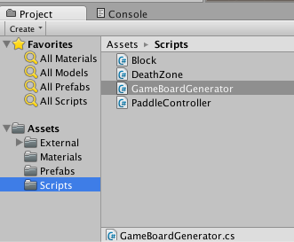
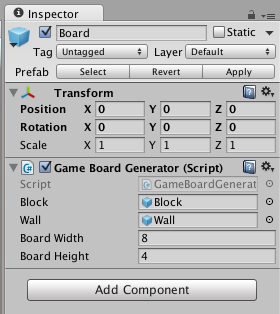

Now we're going to look at the GameBoardGenerator component, located in the scripts folder.



>[action]
>We're going to walk through the code, so open it up in Visual Studios

This component is attached to the Game Board and dynamically generates a board based on the number of rows and column specified in the Editor.

We're going to walk through the Start method so you can see what it does.

```
		GameObject floor = Instantiate(wall) as GameObject;
		GameObject leftWall = Instantiate(wall) as GameObject;
		GameObject rightWall = Instantiate(wall) as GameObject;
```

This code block creates ceiling, floor, left wall and right wall using the Instantiate method.  Instantiate lets you create any kind of object in Unity, so it is important that you say as GameObject to type cast the created object to GameObject. C# is statically typed, and everything must be strongly cast to a specific type. The word cast means change the type. You can change specific types into more generic types when necessary or vice versa.  In this case Instantiate creates an Object, but we know the object will be a GameObject, and we are making a GameObject variable.  You can’t set an Object to a GameObject without telling the compiler you want to do this using a cast, so we use as GameObject to cast.

There is another way to cast also by writing it like this: GameObject ceiling = (GameObject)Instantiate(wall); GameObject ceiling = Instantiate(wall) as GameObject;

```
		rightWall.transform.parent = this.transform;
		leftWall.transform.parent = this.transform;
		ceiling.transform.parent = this.transform;
		floor.transform.parent = this.transform;
```

This code makes the 4 walls children of the game board object — this is how you dynamically child/parent objects.  If you're into object oriented programming, by the way, the words "child" and "parent" mean different things here than they mean in the object-oriented context.

A child moves around based on how the parent moves.

```
		floor.transform.localPosition = new Vector3(boardWidth / 2f, -4f, 0f);
		floor.transform.localScale = new Vector3(boardWidth + 3f, 1f, 1f);
		floor.AddComponent<DeathZone>();

		ceiling.transform.localPosition = new Vector3(boardWidth / 2f, (boardHeight + 2f), 0f);
		ceiling.transform.localScale = new Vector3(boardWidth + 3f, 1f, 1f);

		rightWall.transform.localPosition = new Vector3(-2f, (boardHeight / 2f) - 1f, 0f);
		rightWall.transform.localScale = new Vector3(1f, boardHeight + 7f, 1f);

		leftWall.transform.localPosition = new Vector3(boardWidth + 2f, (boardHeight / 2f) - 1f, 0f);
		leftWall.transform.localScale = new Vector3(1f, boardHeight + 7f, 1f);
```

This code sets the positions and sizes of the objects we just made by setting properties of their transforms.

The transform of a Game Object is a component it has that determines where it is, how big it is, and how its oriented.

```
		for(int i = 0; i <= boardWidth; i++)
		{
			for(int j = 0; j <= boardHeight; j++)
			{
				GameObject newBlock = Instantiate(block) as GameObject;
				newBlock.transform.parent = this.transform;
				newBlock.transform.localPosition = new Vector3((float)i, (float)j, 0f);
			}
		}
	}
```

To make our actual board, we've used two loops, one for rows and one for columns.  We used a scale of 1 so it makes everything very easy, we just create each block and set it’s localPosition to the value of i,j;

If you use localPosition it will be the position relative to the objects parent, if you use position it will be position in world space.

If you're wondering where boardWidth and boardHeight come from, they're public variables on Board.



>[action] Try changing the dimensions of the board.  What do you think will happen?
