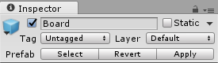
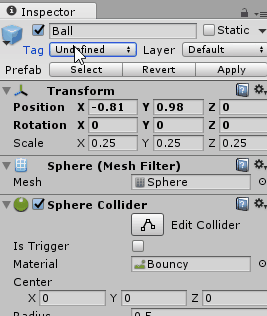

_Tags_ are responsible for killing off a ball after it hits the bottom wall.

_Tags_ in Unity are a nice way to "mark" an object with a piece of information so you can examine it later to make decisions, and you can see them at the top of the Inspector.



We are going to use the Ball tag to detect collisions. The ball is already tagged "Ball" even though it says "Undefined." This discrepancy comes about because the `Ball` comes from an imported package, and the list of tags in our game is part of the settings of our project. When you actually run the game, the correct tag will appear, but let's fix this in a better way.

> [action]
>
Select the dropdown next to `Tag`, select `Add Tag`, click the `+` and add the text `Ball`, and then select the object and set the tag by selecting the newly added `Ball` from the dropdown menu with the Ball object selected.
>


The `Deathzone` is the spot below the paddle, so if you miss the ball you die. It's the part that checks for the "Ball" tag.

> [action]
>
Open up `Deathzone`, which you'll find in the Scripts folder.

In it, you will find this method. We've added comments to explain it.

```
public void OnCollisionEnter(Collision collisionWith)
{
  // if anything collides with this object that has this script let's check if it has the ball tag?
  if(collisionWith.gameObject.tag == "Ball")
  {
    // oh it does, so we are going to reset the ball back to kinematic, this snaps it back to the paddle.
    Rigidbody ballBody = collisionWith.gameObject.GetComponent<Rigidbody>();
    ballBody.isKinematic = true;
  }
}
```

# Explosions

Every block has a `Block` component attached to it, which makes an explosion happen when the ball hits one.

> [action]
>
Open `Block`, which is also located in the Scripts folder.
>
Read through the commented code to see an explanation.

```
// Destroy a block when the ball hits it, and make a nice shiny explosion effect.
public void OnCollisionEnter(Collision collisionWith)
{
  // if anything collides with this block let's see if it has the ball tag?
  if(collisionWith.gameObject.tag == "Ball")
  {
    // This Destroy method destroys an explosion 0.5 seconds after it is created with Instantiate
    Destroy((GameObject)Instantiate(explosionEffect, collisionWith.gameObject.transform.position, collisionWith.gameObject.transform.rotation), 0.5f);

    // This destroy destroys the block.
    Destroy(this.gameObject);
  }
}
```
